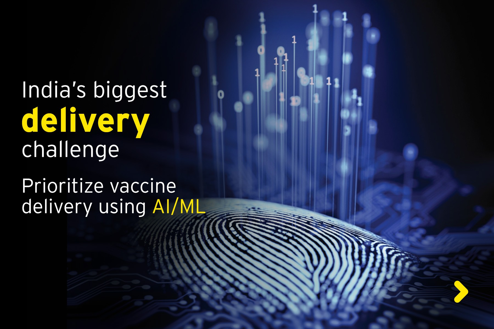

# Prioritize Vaccine Delivery Using AI/ML

<!-- ALL-CONTRIBUTORS-BADGE:START - Do not remove or modify this section -->


<!-- ALL-CONTRIBUTORS-BADGE:END -->  

<!--


-->  

   
  
## The Intro 

This repository is created towards developing a solution for the prject entitled **Prioritize vaccine delivery using AI/ML** of [EY Techathon - 2020](https://www.ey.com/en_in/techathon).  

_**more information about this project** can be found [here](https://www.ey.com/en_in/techathon/problem-statement-ii-prioritize-vaccine-delivery-using-ai-ml)_  

### Objective:  
Our objective is to give a solution for the the problem that __where the vaccine should be delivered first,__ accross the whole nation. Furtheremore, it'll be even better if could give that how much percentage of total dose should be delivered there.  
The priority can be classified on the base of multiple criterion, viz.:  
1. **states** or **union-teritories**  
2. **districts** or **provinces**  
3. **age-group**  
4. **employees' group** _(doctors, police, volenteers etc..)_  

---  

<br />  

## Requirements for the Desired Solution  
The solution should enable one to get the following:
1. a _visual representation of prioritized **states** on **map**_ for the whole country  
2. a _visual representation of prioritized **districts** on **map**_ for every state  
3. _**States** and **Districts** with **highest requirement**_ of the vaccine must always be visible.  
4. Detailed priority (as mentioned in _objective section_) requirement for any searched state should also be possible.  

<br />  

## Steps of the Solution  
We can divide the whole process of this solution in three major parts.  
1. Prioritization for the whole **nation**  
2. Prioritization for the every individual **disrtict**  
3. UI intigration for the solution  

### Elaborating Further  

#### **1. Prioritization for India**  
Here, we'll have to inform that which part or state or population-distribution should get the vaccine, first. For that we have to keep various things into consideration.  
> States can be classified on the following criterion:  
> 1. Affect of COVID-19  
>   * by **zone** (red, orange and green zone by gove.)  
>   * by **percentage** of population **affected9**, out of total  
>   * by **death VS recovery** ratio  
> 2. Population Distribution
>   * by **age-group**  
>   * by **employment status**  
>   * by **literacy-rate**  
> 3. Economy & Development
>   * .....  
>   * **Connectivity** to other states/district (through transportation etc..)  
>   * **Interaction** among the population  

#### **2. Prioritization for a Particular State**  
For a better estimate and results, it is good idea to provide another **prioritization in the state-level**. It will be helpful for the **state governments** to manage the delivery in an optimal way.  
This prioritization can be done district-wise.  
> District can be classified on the following criterion:  
> 1. Affect of COVID-19  
>   * by **zone** (red, orange and green zone by gove.)  
>   * by **percentage** of population **affected9**, out of total  
>   * by **death VS recovery** ratio  
> 2. Population Distribution
>   * by **age-group**  
>   * by **rural VS urban** ratio  
>   * **Interaction** among the population  

#### **3. UI Integration**  
We wish the home screen to have the following structure:  

```
    HOME
    .
    ├── Map (India)        # Bubble Chart for Priority (district-wise)
    │
    ├── 5-States           # with hishest priority 
    │
    ├── 5-Districts        # with hishest priority 
    │
    ├── Population-Wise    # with hishest priority 
    │   │
    │   ├── Top Age-Group 
    │   │
    │   └── Top Employees
    │
    ├── Live COVID-19 Stats   # Overall India 
    │
    └── SEARCH                # Detailed info for any perticular state
        .
        .
        └── ...         
```

One should be able to discover the information about any perticuler **state** on searching.  
This new page should consist of the following:  

```
    STATE
    .
    ├── Map (State)        # Bubble Chart for Priority (district-wise)
    │
    ├── 5-Districts        # with hishest priority 
    │
    ├── Population-Wise    # with hishest priority 
    │   │
    │   ├── Top Age-Group 
    │   │
    │   └── Top Area          # rural or urban
    │
    └── Live COVID-19 Stats   # For current State 
```

> 1. A visualization on the **map**  


<br />  

## Data-Source  
[https://www.covid19india.org/](https://www.covid19india.org/)  
[https://api.covid19india.org/](https://api.covid19india.org/)  


---  

## Countributing to This Project  
You can contribute to this project in various way. Few of them can be:  
1. Providing datasets (as explained above)  
2. Python scripts to scrape, get or clean the datasets  
3. Machine Learning models to classify the datasets on the above mentioned criterion  
4. Designing UI-frameworks (```Django``` or ```Flask``` will be highly prefered)  
5. Enhencement in documentation  
