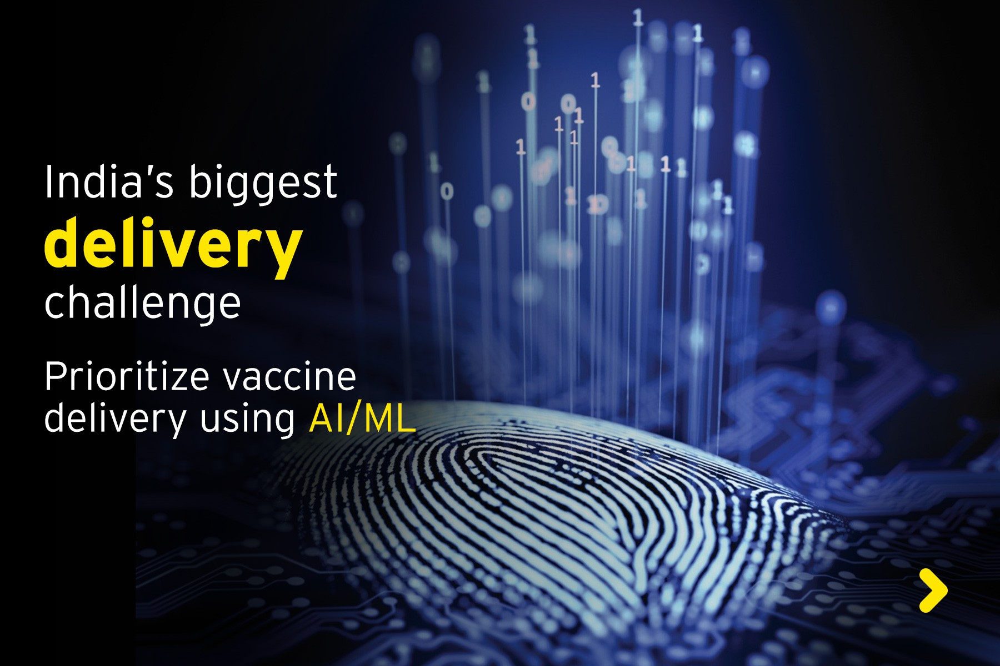

# Prioritize Vaccine Delivery Using AI/ML

<!-- ALL-CONTRIBUTORS-BADGE:START - Do not remove or modify this section -->

<!-- ALL-CONTRIBUTORS-BADGE:END -->  

<!--

-->  

   
  
**The Intro** 

This repo. is created for the _[EY Hackathon Project](https://www.ey.com/en_in/techathon)_.  

More information is yet to be uploaded. Stay tuned for the updates...  

---  
### Sources  
**Data-Source**  
[https://www.covid19india.org/](https://www.covid19india.org/)  
[https://api.covid19india.org/](https://api.covid19india.org/)  

**More Information about this Project**  
[Prioritize vaccine delivery using AI/ML](https://www.ey.com/en_in/techathon/problem-statement-ii-prioritize-vaccine-delivery-using-ai-ml)
